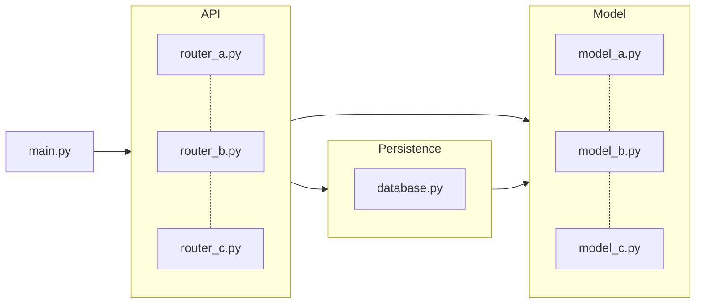

# f-lab-python-backend-project-template

F-lab에서 사용하는 Python backend project template 입니다.

## How to install

### Pre-requisites

- Python 3.11 or higher
- [Poetry](https://python-poetry.org/docs/#installation)

### Install dependencies

```bash
make install
```

## How to run

```bash
make run
```

## Environment variables

환경 변수를 지정하여 구성 값을 조정할 수 있습니다.

| Name | Description             | Default                  |
| --- |-------------------------|--------------------------|
| `WEB_HOST` | Web server host         | `0.0.0.0`                |
| `WEB_PORT` | Web server port         | `8000`                   |
| `DATABASE_URL` | Database SQLAlchemy URL | `sqlite:///./db.sqlite3` |
| `DATABASE_ECHO` | Database echo flag      | `True`                   |
| `CORS_ORIGINS` | CORS origins            | `*`                      |
| `CORS_CREDENTIALS` | CORS credentials flag   | `True`                   |
| `CORS_METHODS` | CORS methods            | `*`                      |
| `CORS_HEADERS` | CORS headers            | `*`                      |

앱은 `.env` 파일 또한 지원합니다.
다음처럼 프로젝트 최상단 경로에 `.env` 파일을 작성하여 필요한 환경 변수를 로드할 수 있습니다.

```bash
# .env

WEB_HOST="0.0.0.0"
WEB_PORT="8000"
DATABASE_URL="sqlite:///./db.sqlite3"
DATABASE_ECHO="True"
CORS_ORIGINS="*"
CORS_CREDENTIALS="True"
CORS_METHODS="*"
CORS_HEADERS="*"
```

관련 코드는 [`config.py`](./src/config.py)에서 확인할 수 있습니다.

## How to develop

### Install dependencies

```bash
make install-dev
```

### Project structure

```bash
.
├── .gitignore                     # git에서 제외할 파일들을 담은 파일
├── .pre-commit-config.yaml        # pre-commit 설정 파일
├── Dockerfile                     # Docker image를 생성하는 파일
├── Makefile                       # 프로젝트와 관련된 명령어들을 담은 파일
├── README.md                      # 프로젝트 문서 파일
├── poetry.lock                    # Poetry가 생성한 파일
├── pyproject.toml                 # 프로젝트 설정 파일
├── src                            # 소스 파일들
│   ├── apis                       # API Layer에 속하는 모듈 파일들
│   │   ├── common                 # 공통 API 모듈 파일들
│   │   │   └── health.py
│   │   ├── dependencies.py        # API Layer에 속하는 모듈들의 의존성을 담은 파일
│   │   └── posts                  # 게시글 API 모듈 파일들
│   │       ├── create_post.py
│   │       ├── get_post.py
│   │       └── get_posts.py
│   ├── config.py                  # 프로젝트 설정과 관련된 파일
│   ├── database.py                # 데이터베이스와 관련된 파일
│   ├── main.py                    # 프로젝트의 시작 로직을 담은 파일
│   ├── models                     # 모델 Layer에 속하는 모듈 파일들
│   │   └── post.py
└── tests                          # 테스트 파일들
    └── apis                       # API Layer에 속하는 모듈을 테스트 하는 파일들
        ├── common                 # 공통 API 모듈을 테스트 하는 파일들
        │   └── test_health.py
        ├── conftest.py            # 테스트에 필요한 공통 설정을 담은 파일
        └── posts                  # 게시글 API 모듈을 테스트 하는 파일들
            ├── test_create_post.py
            ├── test_get_post.py
            └── test_get_posts.py
```

### Architecture



- Layer는 크게 3가지로 나눠집니다.
  - API Layer : API Layer는 API를 정의하는 Layer입니다.
  - Model Layer : Model Layer는 데이터를 정의하는 Layer입니다.
  - Persistence Layer : Persistence Layer는 데이터를 저장하는 Layer입니다.
- Layer간 의존성은 항상 한 쪽 방향으로 향해야 합니다. 예를 들면 다음과 같습니다.
  - API Layer는 Model과 Persistence Layer에만 의존합니다.
  - Persistence Layer는 Model Layer에만 의존합니다.
  - Model Layer는 다른 Layer에 의존하지 않습니다.
- 지금은 Layerd 아키텍처의 일부 예시일 뿐이므로, 필요에 따라 직접 아키텍처를 설계하고 구성해보세요!
  - 하지만 Layer간 의존성은 항상 한 쪽 방향으로 향해야 한다는 걸 명심해주시길 바랍니다.

### How to test

```bash
make test
```

### How to build

```bash
make build
```

### Others

- 파이썬 포매팅 도구로 [black](https://github.com/psf/black), [isort](https://github.com/PyCQA/isort) 그리고 [pycln](https://github.com/hadialqattan/pycln)을 사용합니다.
  - [pre-commit](https://pre-commit.com/)을 사용하여 커밋 전에 자동으로 포매팅을 적용합니다.
  - `make format` 명령어를 사용하여 포매팅을 적용할 수 있습니다.
- [pytest](https://docs.pytest.org/)를 사용하여 테스트를 작성합니다.
  - `make test` 명령어를 사용하여 테스트를 실행할 수 있습니다.
- `make help` 명령어로 실행가능한 명령어들을 확인할 수 있습니다.
